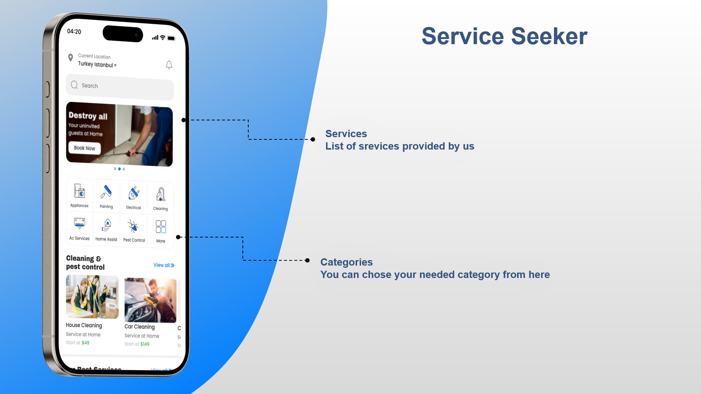
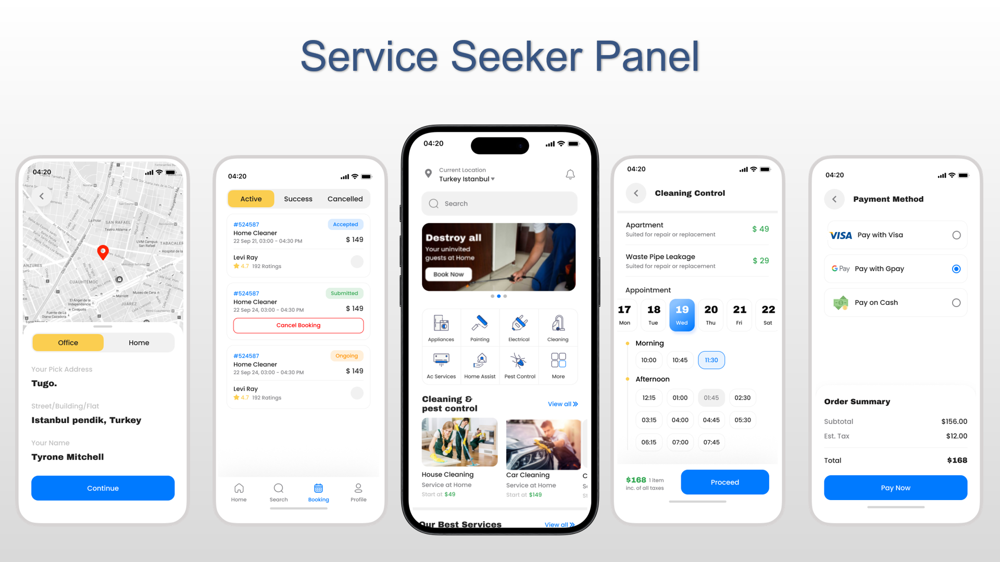
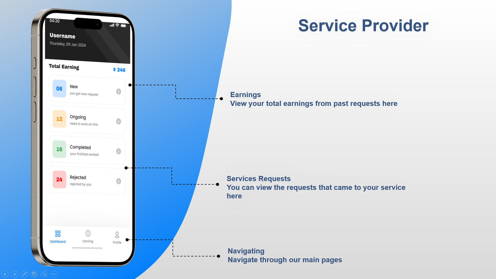
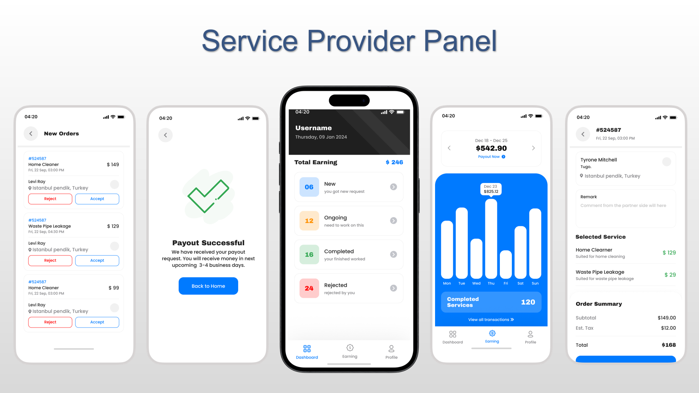
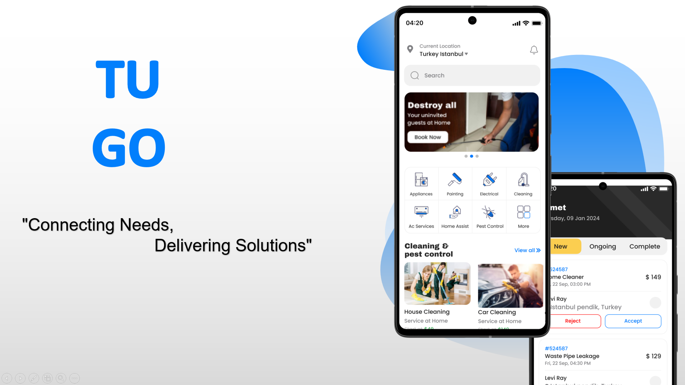
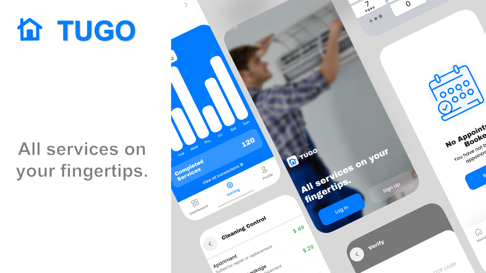

# 🚀 TUGO

**TUGO** is a comprehensive multi-services application designed to connect customers seeking various services with service providers who offer those services. The application features two distinct panels: one for service seekers and one for service providers.

---

## 🔍 Project Overview

- **🛒 Service Seeker Panel:** Browse and interact with services.
- **🏢 Service Provider Panel:** Provides businesses with a platform to manage their services and interact with service seekers.
- **💻 Code Walkthrough:** Offers an overview of the architecture, showcasing the technologies and structure behind the app.

---

## 🎥 Showcase

### 📱 Service Seeker Panel


### **Click the image below to watch the video on how Service Seekers sign up and navigate the app:**

                                                      👇👇👇👇  
[](https://youtu.be/tTpeZyNlGSw)

---

### 🏰 Service Provider Panel


### **Click the image below to watch the video on how Service Providers sign up and navigate the app:**

                                                      👇👇👇👇  
[](https://youtu.be/sxzRsnJE1yA)

---

### 🖥️ Code Walkthrough


### **Click the image below to watch a Code Walkthrough video:**

                                                      👇👇👇👇  
[](https://youtu.be/7serYYUUOfQ)

---

## 🚀 Getting Started

This project is a starting point for a Flutter application. To get started, follow the instructions below:

---

## 🛠️ How to Run the Application

To run the application locally on your machine, follow these steps:

1️⃣ **Clone the repository to your local machine:**
   ```bash
   git clone https://github.com/yourusername/TUGO.git
   ```  

2️⃣ **Navigate to the project directory:**
   ```bash
   cd TUGO
   ```  

3️⃣ **Install dependencies:**
   ```bash
   flutter pub get
   ```  

4️⃣ **Run the application:**
   ```bash
   flutter run
   ```  

---

## 🔧 Technologies Used

Here is a list of the key technologies, tools, and packages used in the development of **TUGO**:

### 🎨 Frontend Development
- **🖥️ Flutter:** The primary framework for building the mobile application, enabling cross-platform development for iOS and Android.
- **🎨 Figma:** Used for UI/UX design, creating prototypes and designing the user interface for a seamless user experience.

### ⚙️ Backend Development
- **🔥 Firebase:** A cloud-based platform for authentication, database management (Firestore), and cloud storage.
- **🖥️ Firebase CLI:** Used for deploying and managing Firebase services.
- **🌍 Node.js:** Used for backend functions and managing packages.
- **📜 JavaScript:** The primary language for backend development, enabling dynamic interactions.
- **☁️ Azure:** Employed for deployment and version control, ensuring robust backend operations.

### 🛠️ Additional Tools and Technologies
- **📦 Flutter Packages:**
    - **📡 cloud_firestore:** Interacts with Firestore (real-time database).
    - **🔒 firebase_auth:** Handles authentication (email/password and social media logins).
    - **📂 firebase_storage:** Stores and retrieves files from Firebase Cloud Storage.
    - **🔄 provider:** Manages state within the Flutter app.
    - **🌐 http:** Makes network requests to APIs.
    - **🗺️ google_maps_flutter:** Integrates Google Maps functionality.

### 🔗 APIs
- **🗺️ Google Maps API:** Enables location-based features for users and service providers.
- **📧 Email.js API:** Sends emails for notifications and verifications.

---

💡 **Feel free to explore the project and get involved! Contributions are always welcome.** 🚀🔥  
